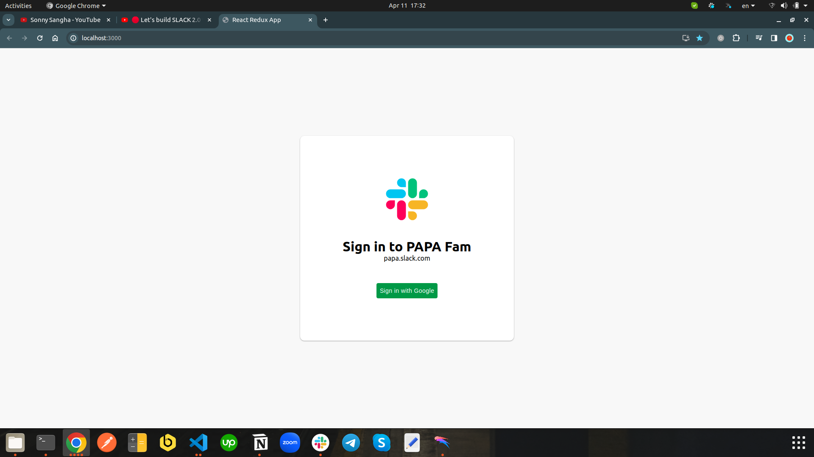
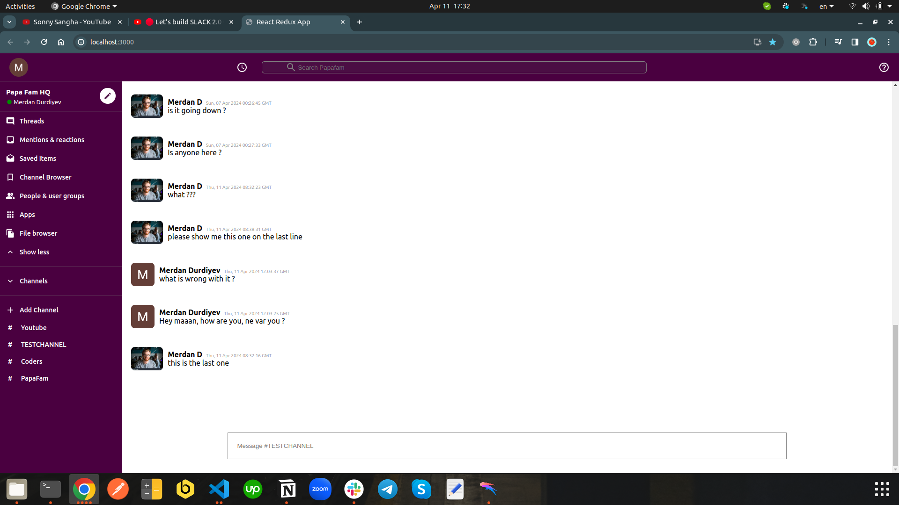

# A simple React web app, a simple clone of Slack.

This project was bootstrapped with [Create React App](https://github.com/facebook/create-react-app), using the [Redux](https://redux.js.org/) for storage and Firebase as a backend.

  &nbsp;&nbsp;
  &nbsp;&nbsp;

## Description

This project was originally created and live streamed by [Sonny Sangha](https://www.youtube.com/@SonnySangha/), an incredible youtuber and React, Next.js developer, Papa React, as he calls himself :+1: .

I created the same clone by watching his video and learned many concepts on React, Redux, Styled Components, and Firebase.
The greatest part of this project is that it has real time updates of messages list when any message is created, on Firebase.

## Screenshots

Here are a couple of screenshots, to get a glimpse of how the web app looks like when it is run.

This one is the first page that opens if the user is not yet registered or logged in:

This page is a screen that is shown if the user is logged in:

## Available Scripts

In the project directory, you can run:

### `npm start`

Runs the app in the development mode.\
Open [http://localhost:3000](http://localhost:3000) to view it in your browser.

The page will reload when you make changes.\
You may also see any lint errors in the console.

